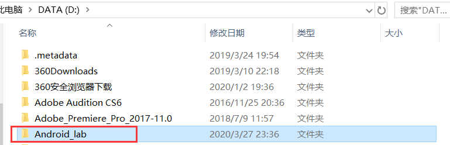
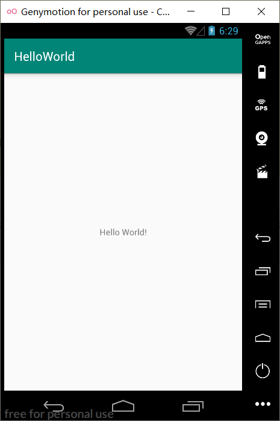
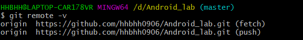
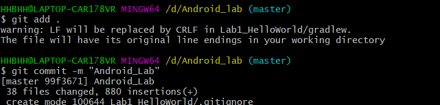
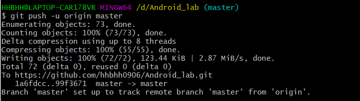
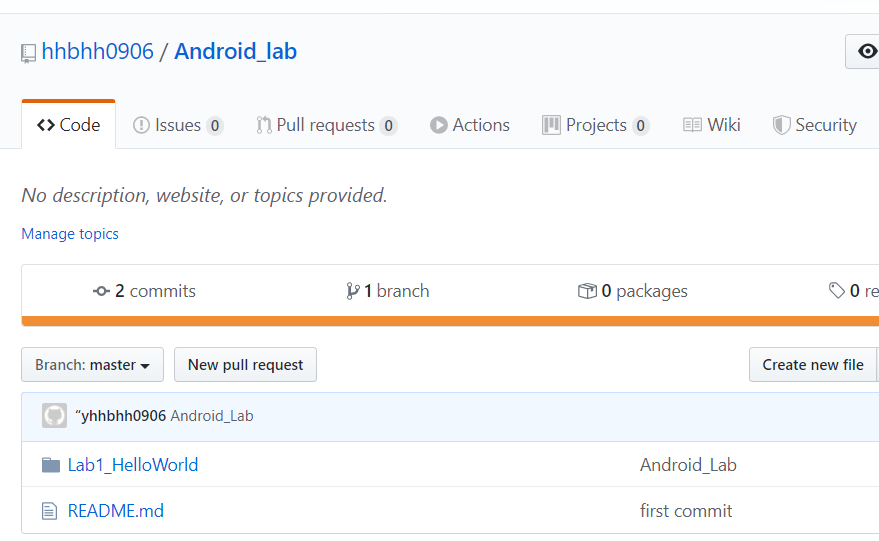

## 实验一  Android开发基础实验

#### 1. 建立android工程目录，比如我的工程Android_Lab



#### 2.建立Android工程HelloWorld



#### 3.右键Android_Lab，选择**Git Bash Here**，出现一个Git Bash命令行窗口，建立一个本地仓库

```
git init
```


#### 4.**添加**远程仓库

```
git remote add origin “your url”
```


#### 5.验证是否添加远程仓库成功

```
git remote -v
```



#### 6.上传工程代码

```
git add .

git commit -m "Android_Lab"

git push -u origin master
```





#### 7.在github上查看结果



