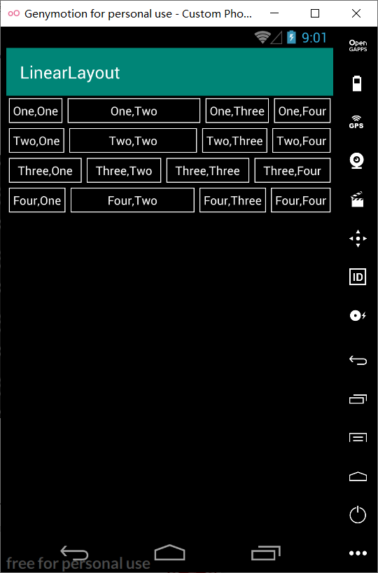
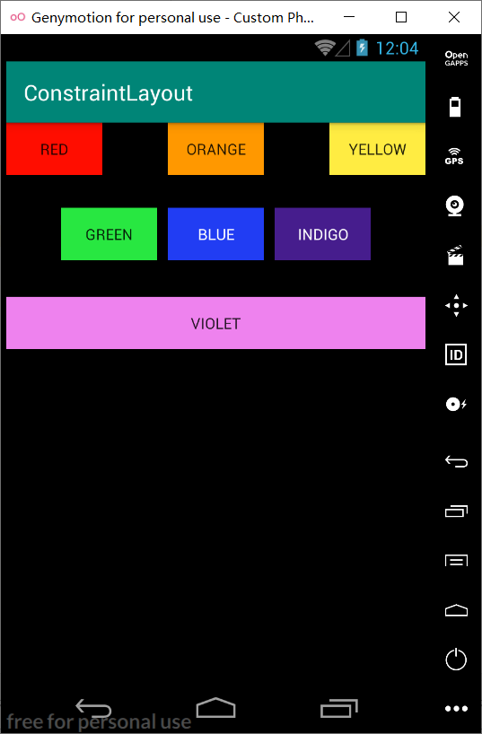
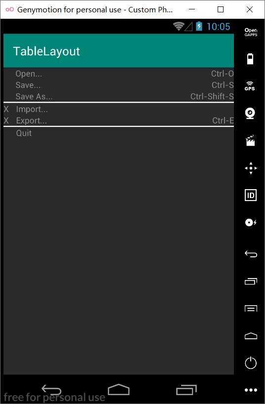

## 实验二  Android界面布局实验

#### 1.线性布局

```
<?xml version="1.0" encoding="utf-8"?>
<LinearLayout xmlns:android="http://schemas.android.com/apk/res/android"
    android:layout_width="match_parent"
    android:layout_height="match_parent"
    android:orientation="vertical"
    android:background="@color/background">

    <LinearLayout
        android:layout_width="match_parent"
        android:layout_height="wrap_content"
        android:orientation="horizontal">

        <TextView
            android:id="@+id/textView1"
            android:layout_width="wrap_content"
            android:layout_height="wrap_content"
            android:layout_margin="3dp"
            android:padding="5dp"
            android:gravity="center"
            android:background="@drawable/border"
            android:text="@string/one_one"
            android:textColor="@color/textcolor"/>

        <TextView
            android:id="@+id/textView2"
            android:layout_width="wrap_content"
            android:layout_height="wrap_content"
            android:layout_margin="3dp"
            android:padding="5dp"
            android:layout_weight="1"
            android:gravity="center"
            android:background="@drawable/border"
            android:text="@string/one_two"
            android:textColor="@color/textcolor"/>

        <TextView
            android:id="@+id/textView3"
            android:layout_width="wrap_content"
            android:layout_height="wrap_content"
            android:layout_margin="3dp"
            android:padding="5dp"
            android:gravity="center"
            android:background="@drawable/border"
            android:text="@string/one_three"
            android:textColor="@color/textcolor"/>

        <TextView
            android:id="@+id/textView4"
            android:layout_width="wrap_content"
            android:layout_height="wrap_content"
            android:layout_margin="3dp"
            android:padding="5dp"
            android:gravity="center"
            android:background="@drawable/border"
            android:text="@string/one_four"
            android:textColor="@color/textcolor"/>

    </LinearLayout>

    <LinearLayout
        android:layout_width="match_parent"
        android:layout_height="wrap_content"
        android:orientation="horizontal">

        <TextView
            android:id="@+id/textView5"
            android:layout_width="wrap_content"
            android:layout_height="wrap_content"
            android:layout_margin="3dp"
            android:padding="5dp"
            android:gravity="center"
            android:background="@drawable/border"
            android:text="@string/two_one"
            android:textColor="@color/textcolor"/>

        <TextView
            android:id="@+id/textView6"
            android:layout_width="wrap_content"
            android:layout_height="wrap_content"
            android:layout_margin="3dp"
            android:padding="5dp"
            android:layout_weight="1"
            android:gravity="center"
            android:background="@drawable/border"
            android:text="@string/two_two"
            android:textColor="@color/textcolor"/>

        <TextView
            android:id="@+id/textView7"
            android:layout_width="wrap_content"
            android:layout_height="wrap_content"
            android:layout_margin="3dp"
            android:padding="5dp"
            android:gravity="center"
            android:background="@drawable/border"
            android:text="@string/two_three"
            android:textColor="@color/textcolor"/>

        <TextView
            android:id="@+id/textView8"
            android:layout_width="wrap_content"
            android:layout_height="wrap_content"
            android:layout_margin="3dp"
            android:padding="5dp"
            android:gravity="center"
            android:background="@drawable/border"
            android:text="@string/two_four"
            android:textColor="@color/textcolor"/>
    </LinearLayout>

    <LinearLayout
        android:layout_width="match_parent"
        android:layout_height="wrap_content"
        android:orientation="horizontal">
        <TextView
            android:id="@+id/textView9"
            android:layout_width="wrap_content"
            android:layout_height="wrap_content"
            android:layout_margin="3dp"
            android:padding="5dp"
            android:layout_weight="1"
            android:gravity="center"
            android:background="@drawable/border"
            android:text="@string/three_one"
            android:textColor="@color/textcolor"/>

        <TextView
            android:id="@+id/textView10"
            android:layout_width="wrap_content"
            android:layout_height="wrap_content"
            android:layout_margin="3dp"
            android:padding="5dp"
            android:layout_weight="1"
            android:gravity="center"
            android:background="@drawable/border"
            android:text="@string/three_two"
            android:textColor="@color/textcolor"/>

        <TextView
            android:id="@+id/textView11"
            android:layout_width="wrap_content"
            android:layout_height="wrap_content"
            android:layout_margin="3dp"
            android:padding="5dp"
            android:layout_weight="1"
            android:gravity="center"
            android:background="@drawable/border"
            android:text="@string/three_three"
            android:textColor="@color/textcolor"/>

        <TextView
            android:id="@+id/textView12"
            android:layout_width="wrap_content"
            android:layout_height="wrap_content"
            android:layout_margin="3dp"
            android:padding="5dp"
            android:layout_weight="1"
            android:gravity="center"
            android:background="@drawable/border"
            android:text="@string/three_four"
            android:textColor="@color/textcolor"/>
    </LinearLayout>

    <LinearLayout
        android:layout_width="match_parent"
        android:layout_height="wrap_content"
        android:orientation="horizontal">
        <TextView
            android:id="@+id/textView13"
            android:layout_width="wrap_content"
            android:layout_height="wrap_content"
            android:layout_margin="3dp"
            android:padding="5dp"
            android:gravity="center"
            android:background="@drawable/border"
            android:text="@string/four_one"
            android:textColor="@color/textcolor"/>

        <TextView
            android:id="@+id/textView14"
            android:layout_width="wrap_content"
            android:layout_height="wrap_content"
            android:layout_margin="3dp"
            android:padding="5dp"
            android:layout_weight="1"
            android:gravity="center"
            android:background="@drawable/border"
            android:text="@string/four_two"
            android:textColor="@color/textcolor"/>

        <TextView
            android:id="@+id/textView15"
            android:layout_width="wrap_content"
            android:layout_height="wrap_content"
            android:layout_margin="3dp"
            android:padding="5dp"
            android:gravity="center"
            android:background="@drawable/border"
            android:text="@string/four_three"
            android:textColor="@color/textcolor"/>

        <TextView
            android:id="@+id/textView16"
            android:layout_width="wrap_content"
            android:layout_height="wrap_content"
            android:layout_margin="3dp"
            android:padding="5dp"
            android:gravity="center"
            android:background="@drawable/border"
            android:text="@string/four_four"
            android:textColor="@color/textcolor"/>
    </LinearLayout>
</LinearLayout>
```



#### 2.约束布局

```
<?xml version="1.0" encoding="utf-8"?>
<androidx.constraintlayout.widget.ConstraintLayout xmlns:android="http://schemas.android.com/apk/res/android"
    xmlns:app="http://schemas.android.com/apk/res-auto"
    xmlns:tools="http://schemas.android.com/tools"
    android:layout_width="match_parent"
    android:layout_height="match_parent"
    android:background="@color/black"
    tools:context=".MainActivity">

    <Button
        android:id="@+id/RED"
        android:layout_width="wrap_content"
        android:layout_height="wrap_content"
        android:background="@color/red"
        android:text="@string/red"
        app:layout_constraintEnd_toStartOf="@+id/ORANGE"
        app:layout_constraintHorizontal_chainStyle="spread_inside"
        app:layout_constraintStart_toStartOf="parent"
        app:layout_constraintTop_toTopOf="parent" />

    <Button
        android:id="@+id/ORANGE"
        android:layout_width="wrap_content"
        android:layout_height="wrap_content"
        android:background="@color/orange"
        android:text="@string/orange"
        app:layout_constraintBottom_toBottomOf="@+id/RED"
        app:layout_constraintEnd_toStartOf="@+id/YELLOW"
        app:layout_constraintStart_toEndOf="@+id/RED"
        app:layout_constraintTop_toTopOf="@+id/RED" />

    <Button
        android:id="@+id/YELLOW"
        android:layout_width="wrap_content"
        android:layout_height="wrap_content"
        android:background="@color/yellow"
        android:text="@string/yellow"
        app:layout_constraintBottom_toBottomOf="@+id/ORANGE"
        app:layout_constraintEnd_toEndOf="parent"
        app:layout_constraintStart_toEndOf="@+id/ORANGE"
        app:layout_constraintTop_toTopOf="@+id/ORANGE" />

    <Button
        android:id="@+id/GREEN"
        android:layout_width="wrap_content"
        android:layout_height="wrap_content"
        android:layout_marginRight="10dp"
        android:background="@color/green"
        android:text="@string/green"
        app:layout_constraintEnd_toStartOf="@+id/BLUE"
        app:layout_constraintHorizontal_chainStyle="packed"
        app:layout_constraintStart_toStartOf="parent"
        app:layout_constraintTop_toTopOf="@+id/BLUE" />

    <Button
        android:id="@+id/BLUE"
        android:layout_width="wrap_content"
        android:layout_height="wrap_content"
        android:layout_marginRight="10dp"
        android:background="@color/blue"
        android:text="@string/blue"
        android:textColor="@color/white"
        app:layout_constraintEnd_toStartOf="@+id/INDIGO"
        app:layout_constraintStart_toEndOf="@+id/GREEN"
        app:layout_constraintTop_toTopOf="@+id/INDIGO" />

    <Button
        android:id="@+id/INDIGO"
        android:layout_width="wrap_content"
        android:layout_height="wrap_content"
        android:layout_marginTop="30dp"
        android:background="@color/indigo"
        android:text="@string/indigo"
        android:textColor="@color/white"
        app:layout_constraintEnd_toEndOf="parent"
        app:layout_constraintStart_toEndOf="@+id/BLUE"
        app:layout_constraintTop_toBottomOf="@+id/ORANGE" />

    <Button
        android:id="@+id/VIOLET"
        android:layout_width="0dp"
        android:layout_height="wrap_content"
        android:background="@color/violet"
        android:text="@string/violet"
        app:layout_constraintBottom_toBottomOf="parent"
        app:layout_constraintEnd_toEndOf="parent"
        app:layout_constraintStart_toStartOf="parent"
        app:layout_constraintTop_toBottomOf="@+id/BLUE"
        app:layout_constraintVertical_bias="0.10" />

</androidx.constraintlayout.widget.ConstraintLayout>
```



#### 3.表格布局

```
<?xml version="1.0" encoding="utf-8"?>
<LinearLayout xmlns:android="http://schemas.android.com/apk/res/android"
    android:layout_width="match_parent"
    android:layout_height="match_parent"
    android:orientation="vertical"
    android:background="@color/background">
    <TableLayout
        android:layout_width="match_parent"
        android:layout_height="wrap_content">
        <TableRow
            android:layout_width="match_parent"
            android:layout_height="match_parent">
            <TextView
                android:layout_width="wrap_content"
                android:layout_height="wrap_content"
                android:paddingLeft="20dp"
                android:text="@string/open"
                android:textColor="@color/gray"
                android:layout_weight="1"/>
            <TextView
                android:layout_width="wrap_content"
                android:layout_height="wrap_content"
                android:text="@string/ctrl_o"
                android:textColor="@color/gray"
                android:gravity="right"/>
        </TableRow>
        <TableRow
            android:layout_width="match_parent"
            android:layout_height="match_parent">
            <TextView
                android:layout_width="wrap_content"
                android:layout_height="wrap_content"
                android:paddingLeft="20dp"
                android:text="@string/sava"
                android:textColor="@color/gray"
                android:layout_weight="1"/>
            <TextView
                android:layout_width="wrap_content"
                android:layout_height="wrap_content"
                android:text="@string/ctrl_s"
                android:textColor="@color/gray"
                android:gravity="right"/>
        </TableRow>
        <TableRow
            android:layout_width="match_parent"
            android:layout_height="match_parent">
            <TextView
                android:layout_width="wrap_content"
                android:layout_height="wrap_content"
                android:paddingLeft="20dp"
                android:text="@string/savaas"
                android:textColor="@color/gray"
                android:layout_weight="1"/>
            <TextView
                android:layout_width="wrap_content"
                android:layout_height="wrap_content"
                android:text="@string/Ctrl_Shift_S"
                android:textColor="@color/gray"
                android:gravity="right"/>
        </TableRow>
        <View
        android:layout_height="2dp"
        android:background="@color/white" />
    </TableLayout>

    <TableLayout
        android:layout_width="match_parent"
        android:layout_height="wrap_content">

        <TableRow
            android:layout_width="match_parent"
            android:layout_height="match_parent">

            <TextView
                android:layout_width="wrap_content"
                android:layout_height="wrap_content"
                android:text="@string/x"
                android:textColor="@color/gray" />

            <TextView
                android:layout_width="wrap_content"
                android:layout_height="wrap_content"
                android:layout_weight="1"
                android:paddingLeft="12dp"
                android:text="@string/Import"
                android:textColor="@color/gray" />
        </TableRow>

        <TableRow
            android:layout_width="match_parent"
            android:layout_height="match_parent">

            <TextView
                android:layout_width="wrap_content"
                android:layout_height="wrap_content"
                android:text="@string/x"
                android:textColor="@color/gray" />
            <TextView
                android:layout_width="wrap_content"
                android:layout_height="wrap_content"
                android:layout_weight="1"
                android:paddingLeft="12dp"
                android:text="@string/Export"
                android:textColor="@color/gray" />

            <TextView
                android:layout_width="wrap_content"
                android:layout_height="wrap_content"
                android:gravity="right"
                android:text="@string/Ctrl_E"
                android:textColor="@color/gray" />
        </TableRow>

        <View
            android:layout_height="2dp"
            android:background="@color/white" />
    </TableLayout>
    <TableLayout
        android:layout_width="match_parent"
        android:layout_height="wrap_content">
        <TableRow
            android:layout_width="match_parent"
            android:layout_height="match_parent">
            <TextView
                android:layout_width="wrap_content"
                android:layout_height="wrap_content"
                android:paddingLeft="21dp"
                android:text="@string/Quit"
                android:textColor="@color/gray" />
        </TableRow>
    </TableLayout>
</LinearLayout>
```

