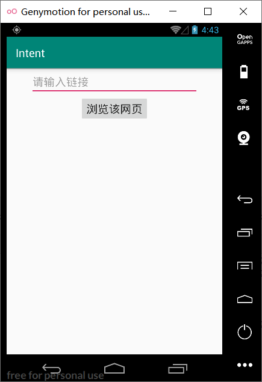
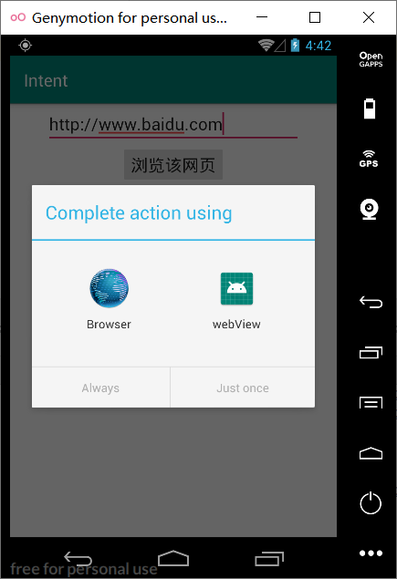
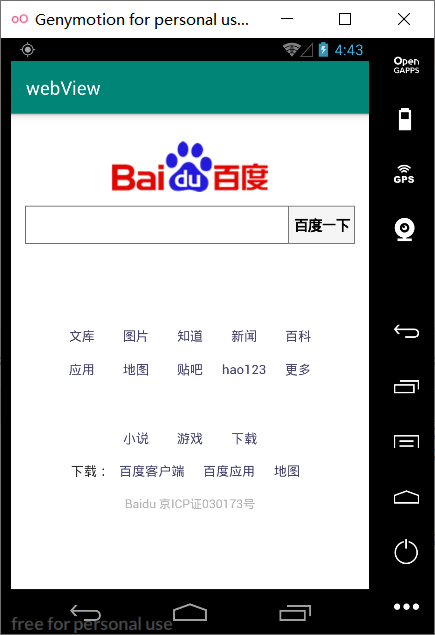

## 实验四  **Intent**

#### **1.**新建一个工程用来获取URL地址并启动Intent

##### activity_main.xml

```
<?xml version="1.0" encoding="utf-8"?>
<LinearLayout xmlns:android="http://schemas.android.com/apk/res/android"
    android:orientation="vertical"
    android:layout_width="match_parent"
    android:layout_height="match_parent"
    android:gravity="center_horizontal">
    <EditText
        android:id="@+id/editText"
        android:layout_width="300dp"
        android:layout_height="wrap_content"
        android:textSize="20sp"
        android:hint="@string/url"
        />
    <Button
        android:id="@+id/btn"
        android:layout_width="wrap_content"
        android:layout_height="wrap_content"
        android:textSize="20sp"
        android:text="@string/btn"
        />
</LinearLayout>
```

##### strings.xml

```
<resources>
    <string name="app_name">Intent</string>
    <string name="url">请输入链接</string>
    <string name="btn">浏览该网页</string>
</resources>
```

##### MainActivity.java

```
package com.example.intent;

import androidx.appcompat.app.AppCompatActivity;
import android.content.Intent;
import android.net.Uri;
import android.os.Bundle;
import android.view.View;
import android.widget.Button;
import android.widget.EditText;

public class MainActivity extends AppCompatActivity {
    @Override
    protected void onCreate(Bundle savedInstanceState) {
        super.onCreate(savedInstanceState);
        setContentView(R.layout.activity_main);
        EditText editText = (EditText) findViewById(R.id.editText);
        Button btn = (Button) findViewById(R.id.btn);
        btn.setOnClickListener((v)->{
            Intent intent = new Intent();
            intent.setAction(Intent.ACTION_VIEW);
            String url = editText.getText().toString();
            intent.setData(Uri.parse(url));
            startActivity(intent);
                });
    }
}
```

#### 2.新建一个工程使用WebView来加载URL

##### activity_main.xml

```
<?xml version="1.0" encoding="utf-8"?>
<androidx.constraintlayout.widget.ConstraintLayout xmlns:android="http://schemas.android.com/apk/res/android"
    xmlns:app="http://schemas.android.com/apk/res-auto"
    xmlns:tools="http://schemas.android.com/tools"
    android:layout_width="match_parent"
    android:layout_height="match_parent"
    tools:context=".MainActivity">
    <WebView
        android:id="@+id/webView"
        android:layout_width="match_parent"
        android:layout_height="match_parent" />
</androidx.constraintlayout.widget.ConstraintLayout>
```

##### AndroidMainfest.xml

```
<?xml version="1.0" encoding="utf-8"?>
<manifest xmlns:android="http://schemas.android.com/apk/res/android"
    package="com.example.webview">

    <application
        android:allowBackup="true"
        android:icon="@mipmap/ic_launcher"
        android:label="@string/app_name"
        android:roundIcon="@mipmap/ic_launcher_round"
        android:supportsRtl="true"
        android:theme="@style/AppTheme"
        android:usesCleartextTraffic="true"
        android:networkSecurityConfig="@xml/network_security_config">
        <activity android:name=".MainActivity">
            <intent-filter>
                <action android:name="android.intent.action.VIEW" />
                <category android:name="android.intent.category.DEFAULT" />
                <category android:name="android.intent.category.BROWSABLE" />
                <data android:scheme="http" />
            </intent-filter>
        </activity>
    </application>
    <uses-permission android:name="android.permission.INTERNET" />
</manifest>
```

##### network_security_config.xml

```
<?xml version="1.0" encoding="utf-8"?>
<network-security-config>
    <base-config cleartextTrafficPermitted="true" />
</network-security-config>
```

##### MainActivity.java

```
package com.example.webview;

import androidx.appcompat.app.AppCompatActivity;
import android.content.Intent;
import android.net.Uri;
import android.os.Bundle;
import android.webkit.WebView;
import android.webkit.WebViewClient;
import java.net.URL;

public class MainActivity extends AppCompatActivity {

    @Override
    protected void onCreate(Bundle savedInstanceState) {
        super.onCreate(savedInstanceState);
        setContentView(R.layout.activity_main);
        Intent intent = getIntent();
        Uri data = intent.getData();
        URL url = null;
        try {
            url = new URL(data.getScheme(), data.getHost(),
                    data.getPath());
        } catch (Exception e) {
            e.printStackTrace();
        }
        startBrowser(url);
    }
    private void startBrowser(URL url) {
        WebView webView = (WebView) findViewById(R.id.webView);
        webView.loadUrl(url.toString());
        webView.setWebViewClient(new WebViewClient(){
            @Override
            public boolean shouldOverrideUrlLoading(WebView view, String url) {
                view.loadUrl(url);
                return true;
            }
        });
    }
}
```

#### 3.运行结果





