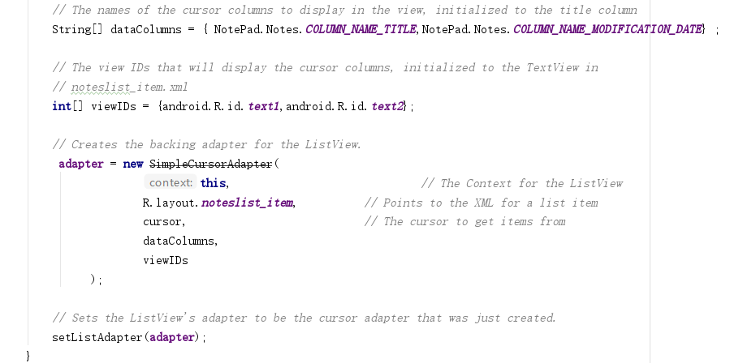
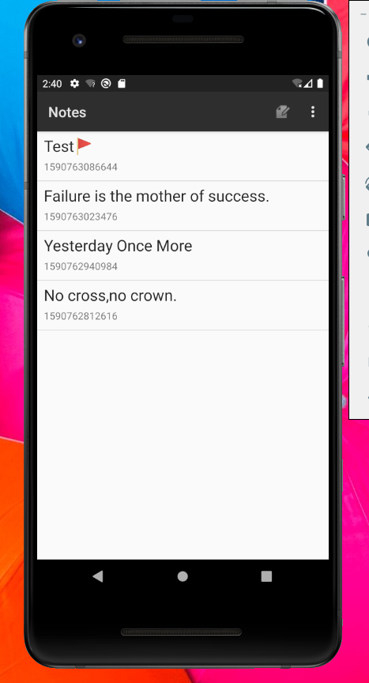
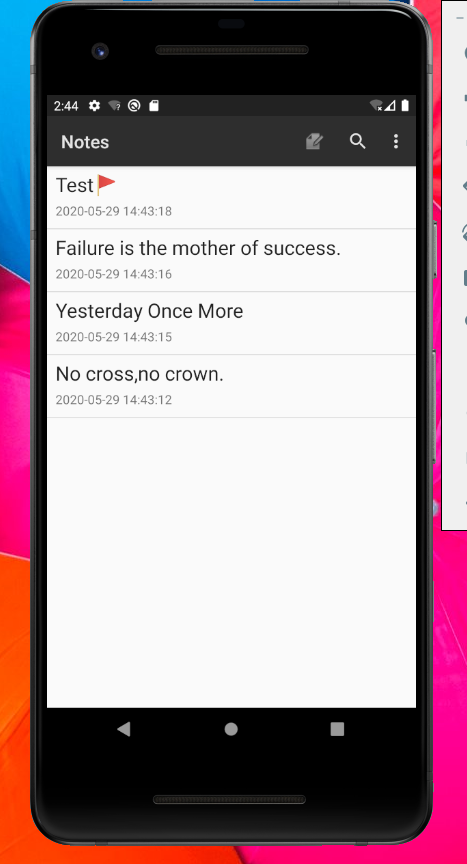
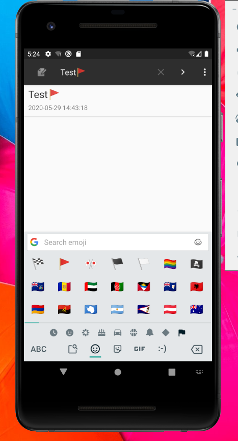

## 期中实验  NotePad

#### 1.NoteList中显示条目增加时间戳显示

##### 第一步：要在每行显示的内容中增加时间戳显示，首先想到的是要对每行的布局进行修改。最初每行的布局中只有一个TextView用于显示笔记的标题，并且没有设置整体的布局格式，因此我们要创建一个垂直方向的线性布局（LinearLayout），并增加一个TextView用于显示时间戳。

##### 对noteslist_item.xml进行修改：

```
<?xml version="1.0" encoding="utf-8"?>
<LinearLayout xmlns:android="http://schemas.android.com/apk/res/android"
    android:orientation="vertical"
    android:layout_width="match_parent"
    android:layout_height="match_parent">
    
    <TextView
        android:id="@android:id/text1"
        android:layout_width="match_parent"
        android:layout_height="match_parent"
        android:gravity="center_vertical"
        android:layout_marginLeft="10dp"
        android:layout_marginBottom="5dp"
        android:layout_marginTop="5dp"
        android:singleLine="true"
        android:textAppearance="?android:attr/textAppearanceLarge" />

    <TextView
        android:id="@android:id/text2"
        android:layout_width="wrap_content"
        android:layout_height="wrap_content"
        android:layout_marginLeft="10dp"
        android:layout_marginBottom="10dp"
        android:singleLine="true"
        android:textAppearance="?android:attr/textAppearanceSmall" />
</LinearLayout>
```

##### 第二步：时间戳所显示的页面是在应用程序的首页，因此要对NotePad的应用程序的入口界面（NotesList）进行修改。仔细查看发现NotesList中的PROJECTION中只含有ID和TITLE两个字段，说明只将数据库表中的ID和TITLE两列内容映射出来了，因此要将时间戳也映射出来（我选择映射的是笔记修改时间，有需要的话可以选择笔记创建时间）。修改完PROJECTION之后，PROJECTION会被放入cursor中，而cursor又会被放入适配器中。

```
    private static final String[] PROJECTION = new String[] {
            NotePad.Notes._ID, // 0
            NotePad.Notes.COLUMN_NAME_TITLE, // 1
            NotePad.Notes.COLUMN_NAME_MODIFICATION_DATE, //2
    };
```

##### 第三步：继续查看NotesList会发现要想让主页显示哪些内容，就需要对适配器进行修改，因此对适配器中的两个内容dataColumns（显示数据列）和viewIDs（布局）进行修改。将笔记修改时间列添加到dataColumns中，将时间戳的布局ID添加到viewIDs中。

```
   String[] dataColumns = {     NotePad.Notes.COLUMN_NAME_TITLE,NotePad.Notes.COLUMN_NAME_MODIFICATION_DATE} ;
   
   int[] viewIDs = {android.R.id.text1,android.R.id.text2};
```



##### 做到这里看似已经可以成功显示时间戳了，先运行查看效果。



##### 在标题下方确实出现了一连串的数字，但是并不是我们人可以轻易阅读时间格式，因此需要对显示的时间格式进行修改。

##### 第四步：要想对笔记修改时间的显示格式进行修改，就想到笔记每次创建或者修改时就需要不断的更新时间，因此就到笔记编辑界面（NoteEditor）来寻找和更新时间有关的函数。会找到一个updateNote方法，方法中有一行代码为：

```
values.put(NotePad.Notes.COLUMN_NAME_MODIFICATION_DATE,System.currentTimeMillis());
```

##### 其中System.currentTimeMillis()很明显就是显示系统时间的函数。因此要在这里进行改动。我选择自己编写了一个转换时间的方法CurrentTime，功能就是将一连串的数字按照我定义的格式来显示时间。

```
    public String CurrentTime() {
        Date nowTime = new Date(System.currentTimeMillis());//转换为人能阅读的规范格式的时间信息
        SimpleDateFormat simpleDateFormat = new SimpleDateFormat("yyyy-MM-dd HH:mm:ss");//按人为定义的格式显示时间信息
        String CurrentDate = simpleDateFormat.format(nowTime);
        return CurrentDate;
    }
```

##### 之后再对updateNote方法中的代码进行修改，调用CurrentTime来完成对时间的转换。

```
values.put(NotePad.Notes.COLUMN_NAME_MODIFICATION_DATE, this.CurrentTime());
```

##### 完成上述所有步骤，显示时间戳的功能就大功告成了，接下来让我们来看一下运行结果：


#### 2.添加笔记本查询功能

##### 我的构想是要在上方的菜单栏添加一个搜索图标，点击之后能够显示搜索框，之后输入文字可以进行相关查询。

##### 第一步：为了能在菜单栏中添加搜索按钮，首先想到的依旧是修改上方菜单栏的布局。在网上查过资料之后了解到Android3.0之后有一个Item叫做SearchView，就是用来显示搜索图标，并且点击之后能显示搜索框，因此我就选用了这个Item。

##### 对list_options_menu.xml进行修改：

```
<?xml version="1.0" encoding="utf-8"?>
<menu xmlns:android="http://schemas.android.com/apk/res/android">
    <!--  This is our one standard application action (creating a new note). -->

    <item
        android:id="@+id/menu_add"
        android:alphabeticShortcut='a'
        android:icon="@drawable/ic_menu_compose"
        android:showAsAction="always"
        android:title="@string/menu_add" />
    <item
        android:id="@+id/menu_search"
        android:actionViewClass="android.widget.SearchView"
        android:icon="@drawable/ic_search_black_24dp"
        android:showAsAction="always"
        android:title="Search" />
    <item android:id="@+id/menu_paste"
          android:icon="@drawable/ic_menu_compose"
          android:title="@string/menu_paste"
          android:alphabeticShortcut='p' />
</menu>
```

##### 完成上述布局的修改之后我们先来看一下运行结果：



##### 确实出现了搜索图标，继续点击搜索图标。


##### 也确实弹出了搜索框，但是非常遗憾还不能进行搜索功能。因此就想到需要定义有关于搜索的方法。

##### 第二步：因为菜单栏也在应用程序的主页面显示，所以同样要对NotePad的应用程序的入口界面（NotesList）进行修改。寻找和菜单有关的函数以后会发现onCreateOptionsMenu方法，这个方法在每次菜单被创建时就会被调用，因此想到将布局中添加的SearchView组件在这边实现它的具体功能。首先我先自定义了一些SearchView的几个小功能，例如设置默认提示文字之类的。

```
        searchView = (SearchView) menu.findItem(R.id.menu_search).getActionView();
        //设置SearchView自动缩小为图标
        searchView.setIconifiedByDefault(true);//设为true则搜索栏缩小成一个图标点击展开
        //设置该SearchView显示搜索按钮
        searchView.setSubmitButtonEnabled(true);
        //设置默认提示文字
        searchView.setQueryHint("Please input what you want to search");
```

##### 之后对SearchView配置监听器，也就是定义点击搜索按钮之后触发的搜索方法。定义一个字段newText（输入的搜索内容），希望通过newText能够找到数据库中与之匹配的标题内容。因此我定义了一个selection用于之后的数据库查询：

```
String selection = NotePad.Notes.COLUMN_NAME_TITLE + " GLOB '*" + newText + "*'";
```

##### 之后我们需要思考如何对SQLite进行查询，这边我想到的是通过ContentResolver和ContentProvider进行交互，采用了getContentResolver().query方法查询SQlite中与selection匹配的内容。如果newText为空（即没有输入任何搜索内容），那就显示所有内容。查询完后要将查询到的cursor更新到适配器中具体代码如下：

```
    @Override
    public boolean onCreateOptionsMenu(Menu menu) {
        // Inflate menu from XML resource
        MenuInflater inflater = getMenuInflater();
        inflater.inflate(R.menu.list_options_menu, menu);
        searchView = (SearchView) menu.findItem(R.id.menu_search).getActionView();
        //设置SearchView自动缩小为图标
        searchView.setIconifiedByDefault(true);//设为true则搜索栏缩小成一个图标点击展开
        //设置该SearchView显示搜索按钮
        searchView.setSubmitButtonEnabled(true);
        //设置默认提示文字
        searchView.setQueryHint("Please input what you want to search");
        //配置监听器
        searchView.setOnQueryTextListener(new SearchView.OnQueryTextListener() {
            //点击搜索按钮时触发
            @Override
            public boolean onQueryTextSubmit(String query) {
                return true;
            }
            @Override
            public boolean onQueryTextChange(String newText) {
                //如果newText长度不为0
                if (!newText.isEmpty()){
                    String selection = NotePad.Notes.COLUMN_NAME_TITLE + " GLOB '*" + newText + "*'";
                    queryCursor = getContentResolver().query(
                            getIntent().getData(),
                            PROJECTION,
                            selection,
                            null,
                            NotePad.Notes.DEFAULT_SORT_ORDER
                    );
                }else{
                    queryCursor = getContentResolver().query(
                            getIntent().getData(),
                            PROJECTION,
                            null,
                            null,
                            NotePad.Notes.DEFAULT_SORT_ORDER
                    );
                }
                adapter.swapCursor(queryCursor);
                adapter.notifyDataSetChanged();
                return true;
            }
        });
        // Generate any additional actions that can be performed on the
        // overall list.  In a normal install, there are no additional
        // actions found here, but this allows other applications to extend
        // our menu with their own actions.
        Intent intent = new Intent(null, getIntent().getData());
        intent.addCategory(Intent.CATEGORY_ALTERNATIVE);
        menu.addIntentOptions(Menu.CATEGORY_ALTERNATIVE, 0, 0,
                new ComponentName(this, NotesList.class), null, intent, 0, null);
        return super.onCreateOptionsMenu(menu);
    }
```

##### 到此为止，就已经实现NotePad的搜索功能了，接下来我来运行一下程序，查看一下效果：


